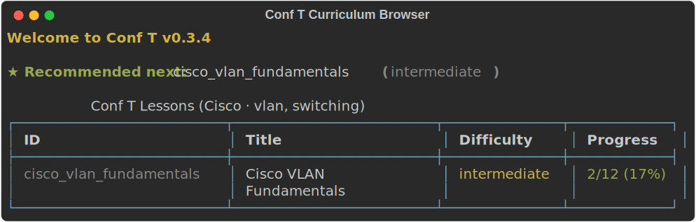

# Conf T 🖥️

> A professional CLI training tool for practicing command-line skills across multiple platforms.

[](LICENSE)
[](https://github.com/Elshayib/conf-t/actions/workflows/ci.yml)
[](https://www.python.org/)
[]()

---

## What is Conf T?

**Conf T** is an interactive, terminal-based learning tool that helps you practice real command-line commands across multiple environments — without needing access to live hardware or cloud instances.

You get a simulated shell prompt, type the command, and receive instant feedback. Missed it? Get a hint. Stuck? Skip and review later. Conf T tracks your progress so every session builds on the last.

---

## ✨ Features

| Feature | Description |
|---|---|
| 🖥️ **Simulated Prompts** | Realistic shell prompts per platform (`Router#`, `user@ubuntu:~$`, `PS C:\>`) |
| ✅ **Smart Validation** | Regex-based matching with alias support (e.g. `conf t` → `configure terminal`) |
| 🔄 **Review Mode** | Automatically re-queues skipped/failed commands for targeted practice |
| 💡 **Hints & Explanations** | Type `hint` for a nudge; get a full explanation after each answer |
| 📊 **Progress Tracking** | Accuracy stats, completed lessons, and history saved locally |
| 🧩 **Extensible** | Add new lessons by dropping a JSON file into `conf_t/lessons/` |
| 🎫 **Multiple Platforms** | 640+ tasks across Cisco IOS, Linux, PowerShell, Git, and Docker |
| 📚 **Structured Curriculum** | Beginner → advanced learning paths with prerequisites and capstone labs |
| 🗺️ **Curriculum Browser** | Difficulty grouping, progress icons, recommended next lesson, soft prerequisite warnings |

---

## 🚀 Quick Start

### Requirements

- Python 3.10+
- pip

### Installation

```bash
# 1. Clone the repository
git clone https://github.com/Elshayib/conf-t.git
cd conf-t

# 2. (Recommended) Create a virtual environment
python -m venv venv
source venv/bin/activate        # Linux / macOS
.\venv\Scripts\Activate.ps1     # Windows PowerShell

# 3. Install in editable mode
pip install -e .

# 4. Launch!
conf-t
```

---

## 🎮 Usage

```
conf-t
```

You will be greeted with an interactive menu:

```
╔══════════════════════════════╗
║         Conf T  v0.3.4       ║
╚══════════════════════════════╝

? Select an option:
  › ★ Daily Review (3 due)     ← shown when tasks are ready
    1. Practice a Lesson
    2. Review All Failed Commands
    3. View Progress & Stats
    4. Reset All Progress
    5. Create a Custom Lesson
    6. Exit
```

### Curriculum browser



When practicing a lesson, the curriculum browser groups lessons by difficulty, shows your progress (✓ ◐ ○) and **passed/total · %** (e.g. `7/12 · 58%`), highlights a **recommended next** lesson, and lets you **filter by topic tags**. Prerequisites warn softly before starting. Re-entering a lesson lets you **resume**, **start over**, or **pick a task** to continue from.

**Spaced repetition:** failed commands resurface on a schedule (due now → 1 day → 3 days → 7 days). When tasks are due, **Daily Review** appears at the top of the main menu.

### CLI flags (power users)

```bash
conf-t                              # interactive menu (default)
conf-t --list                       # list all lessons
conf-t --list --platform Cisco      # filter by platform
conf-t --list --tags vlan,ospf      # filter by tags
conf-t --lesson cisco_basic         # start a lesson by ID
conf-t --review                     # daily review (due tasks)
conf-t --review-all                 # review entire failed queue
conf-t --stats                      # print progress and exit
conf-t --version
```

During a practice session:

| Input | Action |
|---|---|
| `hint` | Show a hint without using an attempt |
| `skip` | Reveal the answer and move on |
| `exit` / `quit` | Confirm and exit the session |

---

## 📦 Lesson Library

Conf T ships with **68 lessons** and **640 practice tasks** across five platforms.

| Platform | Lessons | Tasks | Focus |
|---|---|---|---|
| Cisco IOS | 21 | 231 | CCNA-aligned switching, routing, security, services |
| Linux | 15 | 144 | Shell, systemd, networking, scripting, troubleshooting |
| PowerShell | 12 | 102 | Cmdlets, pipeline, scripting, remoting, automation |
| Git | 10 | 80 | Workflow, branching, merging, recovery |
| Docker | 10 | 83 | Images, containers, compose, networking, volumes |

### Cisco IOS Curriculum (CCNA-aligned)

| Difficulty | Lessons |
|---|---|
| Beginner | `cisco_basic`, `cisco_show_commands`, `cisco_interface_basics` |
| Intermediate | `cisco_vlan_fundamentals`, `cisco_trunking_dtp`, `cisco_inter_vlan_routing`, `cisco_etherchannels`, `cisco_stp`, `cisco_static_routing`, `cisco_ospf_single_area`, `cisco_nat_pat`, `cisco_dhcp`, `cisco_acl_standard`, `cisco_port_security`, `cisco_ssh_hardening` |
| Advanced | `cisco_ospf_multiarea`, `cisco_acl_extended`, `cisco_wlan`, `cisco_qos`, `cisco_hsrp`, `cisco_troubleshooting_lab` |

### Linux Curriculum

| Difficulty | Lessons |
|---|---|
| Beginner | `linux_basic`, `linux_file_operations`, `linux_text_processing`, `linux_package_management` |
| Intermediate | `linux_advanced`, `linux_permissions_deep`, `linux_process_management`, `linux_systemd`, `linux_networking`, `linux_users_groups`, `linux_cron_scheduling` |
| Advanced | `linux_lvm_storage`, `linux_firewall`, `linux_shell_scripting`, `linux_troubleshooting_lab` |

### PowerShell, Git & Docker

Each platform follows a **beginner → intermediate → advanced → capstone** path. Capstone labs (`*_troubleshooting_lab`) mix scenarios from prior lessons. Use the in-app lesson browser to explore the full list.

> **Progress migration:** v0.3.0 adds per-task progress (`task_progress`) and migrates existing `failed_tasks` automatically. Task IDs use the format `lesson_id__action`. Legacy v0.1.x progress should still be reset from the main menu if task IDs no longer match.

---

## 🧩 Adding Custom Lessons

Create a `.json` file in `conf_t/lessons/` using this schema:

```json
{
  "id": "my_custom_lesson",
  "title": "My Custom Lesson",
  "platform": "Cisco",
  "description": "Short description of what this lesson covers.",
  "difficulty": "beginner",
  "tags": ["custom"],
  "prerequisites": ["cisco_basic"],
  "estimated_minutes": 15,
  "tasks": [
    {
      "id": "my_custom_lesson__configure_terminal",
      "prompt": "Enter global configuration mode.",
      "prefix": "Router#",
      "expected": "^configure\\s+terminal$",
      "aliases": ["conf t", "config t"],
      "hint": "The command starts with 'configure'.",
      "explanation": "'configure terminal' (or 'conf t') enters global config mode."
    }
  ]
}
```

**Task ID convention:** `{lesson_id}__{action_slug}` — globally unique across all lessons (required at scale).

> **Platform case rules:**
> - `Cisco`, `PowerShell` → **case-insensitive** matching
> - `Linux`, `Git`, `Docker` → **case-sensitive** matching

---

## 🏗️ Architecture

```
conf_t/
├── main.py        # Entry point — bootstraps the app
├── cli.py         # All UI/terminal rendering and menus
├── engine.py      # Business logic (pure Python, no UI)
├── models.py      # Data classes: Task, Lesson, SessionStats
└── lessons/       # JSON lesson files (one per lesson)
```

> **Design principle:** `engine.py` is completely UI-agnostic — making it trivial to expose the engine via a REST API (FastAPI) or port it to a mobile/web frontend in the future.

---

## 🤝 Contributing

Contributions, lesson packs, and bug reports are very welcome! Please read [CONTRIBUTING.md](CONTRIBUTING.md) before opening a PR.

See [CHANGELOG.md](CHANGELOG.md) for release history.

---

## 📄 License

This project is licensed under the **MIT License** — see the [LICENSE](LICENSE) file for details.

---

<p align="center">Made with ❤️ by <a href="https://github.com/Elshayib">Islam Elshayib</a></p>
